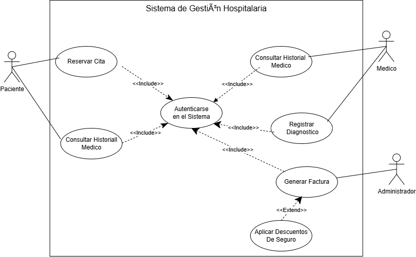

# Documentación de Arquitectura: Casos de Uso

## 1. Descripción del Módulo
El presente documento definelo srequisitos funcionales del **Sistema de Gestión Hospitalaria**. Se detalla la interacción entre los actores (Paciente, Médico, Administrador) y las funcionalidades del sistema.

## 2. Diagrama UML de Casos de Uso

## 3. Especificación de Relaciones
* **Relaciones<<include>>:** *Reservar Cita* y *Generar Factura* requieren obligatoriamente la autenticación previa del usuario en el sistema.
* **Relaciones<<include>>:** *Aplicar Descuento de Seguro* se ejecuta únicamente si la factura generada cuenta con cobertura médica.
  
