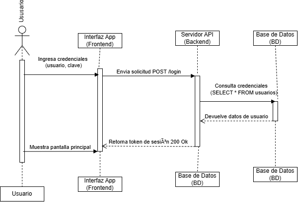

# Especificación de Secuencia: Autenticación de Usuario

## 1. Contexto del Flujo
Se describe la interacción temporal entre la interfaz móvil, la API backend y la base de datos para la validación de credenciales.

## 2. Diagrama UML de Secuencia

## 3. Detalle de los Pasos
1. El usuario ingresa sus credenciales en la aplicación.
2. La aplicación envía una solicitud HTTP POST al sevidor. 
3. El servidor valida la información consultando la base de datos.
4. La base de datos responde con los datos del usuario.
5. El servidor genera y retorna un token de sesión `200 OK´.
6. La aplicación muestra la pantalla principal.

## 5. Enlaces Útiles
- [Ver Arquitectura del Sistema](docs/arquitectura.md)
[Ver Casos de Uso Hospitalarios](docs/arquitectura/casos-de-uso.md)
- [Ver Diagrama de Secuencia de Login](docs/arquitectura/secuencia-autenticacion.md)
- [Ver Arquitectura del Sistema](docs/arquitectura.md)
- [Ver Manual de Usuario](docs/manual usuario.md)
- [Ver Especificacion de API](docs/api_endpoints.md)
- [Repositorio Oficial en GitHub] (https://github.com/viclaix66/documentacion-sistema-v1-)