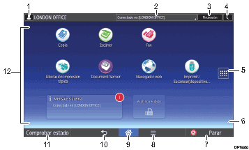

# Manual de Usuario - Guía de Inicio Rápido

## 1. Requisitos del Sistema
- Navegador web moderno (Google Chrome, Mozilla Firefox, Microsoft Edge).
- Conexión a la red local de la empresa.
- Entorno de ejecución Python 3.10 o superior instalado.

## 2. Pasos para Iniciar la Aplicación
1. Abrir la terminal o consola de comandos del sistema operativo.
2. Navegar a la carpeta raíz del proyecto y ejecutar el comando de arranque:
   ```bash
   python main.py

   [Inicio de Sesión] ---> [Seleccionar Módulo] ---> [Procesar Datos] ---> [Cerrar Sesión]

   ## 4. Captura de Pantalla del Sistema
*(Asegúrate de guardar una imagen llamada `pantalla.png` dentro de la carpeta `docs/assets/` o usa una imagen de prueba)*.



## 5. Navegación
- [Ver Arquitectura del Sistema](arquitectura.md)
- [Volver al README Principal](../README.md)
