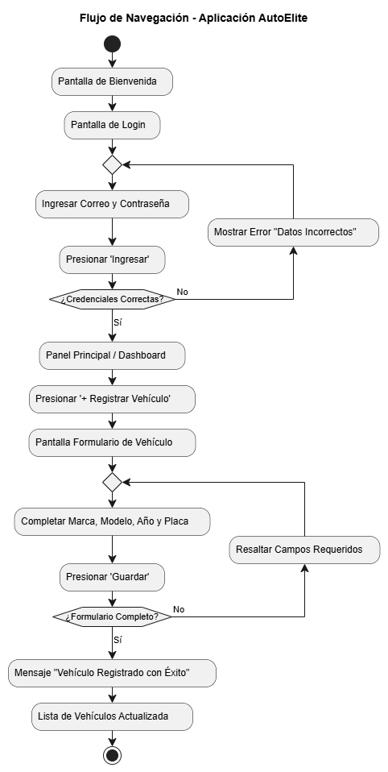
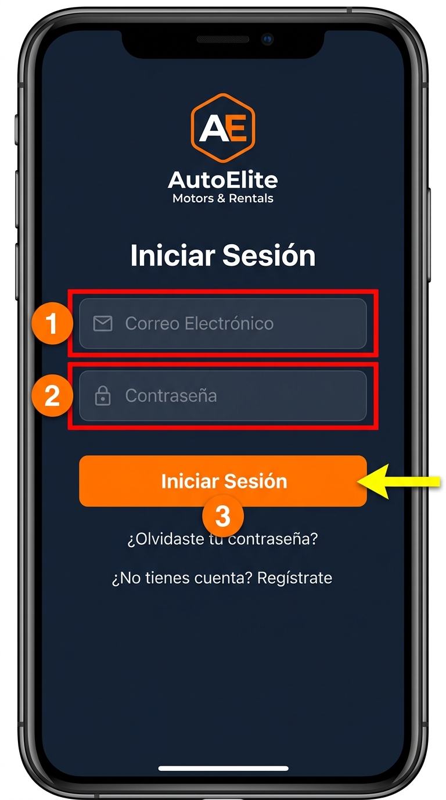
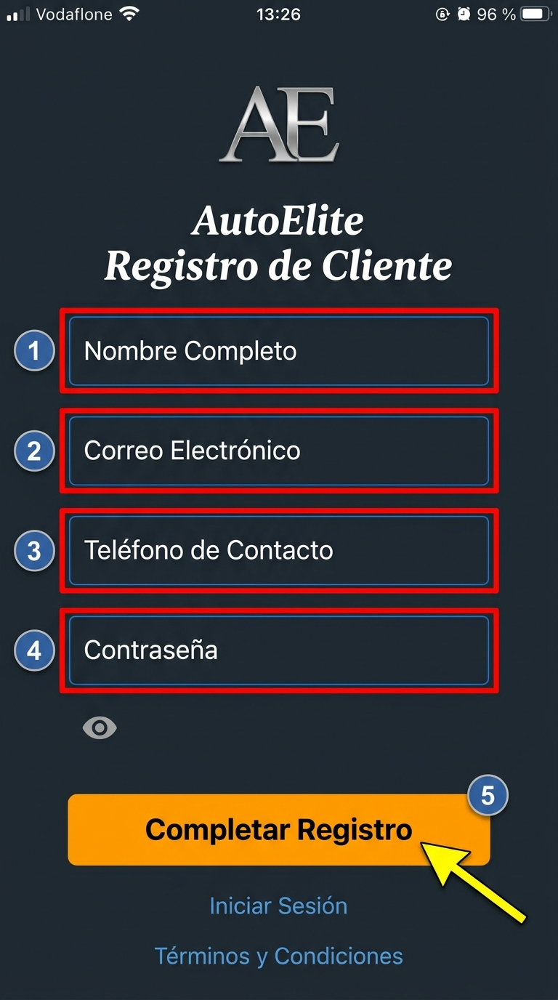

# Guía Visual de Navegación y Uso de la Aplicación
Bienvenido a la guía de uso de la aplicación. Este manual te explicará paso a paso cómo utilizar
las funciones principales de forma rápida y sencilla.
---
## 1. Mapa General de Navegación
A continuación se muestra el recorrido visual de las pantallas dentro de la aplicación:

---
## 2. Paso a Paso: Cómo Iniciar Sesión
Para acceder a tu cuenta en la aplicación, realiza las siguientes acciones:

1. **Correo Electrónico (1):** Ingresa la dirección de correo con la que creaste tu cuenta.
2. **Contraseña (2):** Escribe tu clave de acceso personal.
3. **Boton 'Ingresar' (3):** Presiona el botón azul para entrar a tu pantalla principal.
> **Sugerencia:** Si olvidaste tu clave de acceso, toca el enlace *"¿Olvidaste tu contraseña?"*
para recuperarla.
---
## 3. Paso a Paso: Cómo Registrar Información

1. **Seleccionar Opción:** Toca el icono **"+"** ubicado en la esquina superior derecha.
2. **Completar Formulario:** Llena los campos marcados como obligatorios.
3. **Confirmar:** Presiona **"Guardar"** para almacenar los cambios.